# 复习笔记

- [复习笔记](#%e5%a4%8d%e4%b9%a0%e7%ac%94%e8%ae%b0)
  - [操作系统](#%e6%93%8d%e4%bd%9c%e7%b3%bb%e7%bb%9f)
    - [1.多线程操作相关](#1%e5%a4%9a%e7%ba%bf%e7%a8%8b%e6%93%8d%e4%bd%9c%e7%9b%b8%e5%85%b3)
    - [2.多线程同步相关](#2%e5%a4%9a%e7%ba%bf%e7%a8%8b%e5%90%8c%e6%ad%a5%e7%9b%b8%e5%85%b3)
    - [3.守护进程](#3%e5%ae%88%e6%8a%a4%e8%bf%9b%e7%a8%8b)
    - [4.进程、线程状态查看](#4%e8%bf%9b%e7%a8%8b%e7%ba%bf%e7%a8%8b%e7%8a%b6%e6%80%81%e6%9f%a5%e7%9c%8b)
    - [5.内存和IO](#5%e5%86%85%e5%ad%98%e5%92%8cio)
    - [6.文件基本](#6%e6%96%87%e4%bb%b6%e5%9f%ba%e6%9c%ac)
    - [7.软连接](#7%e8%bd%af%e8%bf%9e%e6%8e%a5)
    - [8.进程间通信](#8%e8%bf%9b%e7%a8%8b%e9%97%b4%e9%80%9a%e4%bf%a1)
    - [9.虚拟内存相关](#9%e8%99%9a%e6%8b%9f%e5%86%85%e5%ad%98%e7%9b%b8%e5%85%b3)
    - [10.页缓存、页回写、内存映射](#10%e9%a1%b5%e7%bc%93%e5%ad%98%e9%a1%b5%e5%9b%9e%e5%86%99%e5%86%85%e5%ad%98%e6%98%a0%e5%b0%84)
    - [11.定时器](#11%e5%ae%9a%e6%97%b6%e5%99%a8)
  - [网络](#%e7%bd%91%e7%bb%9c)
    - [1.TCP状态机](#1tcp%e7%8a%b6%e6%80%81%e6%9c%ba)
    - [2.tcpdump(抓包)](#2tcpdump%e6%8a%93%e5%8c%85)
    - [3.网络状态和防火墙(netstat/ifconifg/iptables)](#3%e7%bd%91%e7%bb%9c%e7%8a%b6%e6%80%81%e5%92%8c%e9%98%b2%e7%81%ab%e5%a2%99netstatifconifgiptables)
    - [4.socket API(重点)](#4socket-api%e9%87%8d%e7%82%b9)
    - [5.IO复用](#5io%e5%a4%8d%e7%94%a8)
    - [5.HTTP和HTTPS的区别(优缺点，不同)](#5http%e5%92%8chttps%e7%9a%84%e5%8c%ba%e5%88%ab%e4%bc%98%e7%bc%ba%e7%82%b9%e4%b8%8d%e5%90%8c)
    - [6.HTTP返回码](#6http%e8%bf%94%e5%9b%9e%e7%a0%81)
    - [7.浏览器输入URL发生的事，用到了哪些层](#7%e6%b5%8f%e8%a7%88%e5%99%a8%e8%be%93%e5%85%a5url%e5%8f%91%e7%94%9f%e7%9a%84%e4%ba%8b%e7%94%a8%e5%88%b0%e4%ba%86%e5%93%aa%e4%ba%9b%e5%b1%82)
    - [8.GET和POST的区别](#8get%e5%92%8cpost%e7%9a%84%e5%8c%ba%e5%88%ab)
    - [9.TCP](#9tcp)
  - [脚本工具awk，sed，cat)](#%e8%84%9a%e6%9c%ac%e5%b7%a5%e5%85%b7awksedcat)
    - [1.cat](#1cat)
  - [编程语言](#%e7%bc%96%e7%a8%8b%e8%af%ad%e8%a8%80)
  - [算法和数据结构](#%e7%ae%97%e6%b3%95%e5%92%8c%e6%95%b0%e6%8d%ae%e7%bb%93%e6%9e%84)
    - [1.一致性哈希](#1%e4%b8%80%e8%87%b4%e6%80%a7%e5%93%88%e5%b8%8c)
    - [2.胜者树，败者树](#2%e8%83%9c%e8%80%85%e6%a0%91%e8%b4%a5%e8%80%85%e6%a0%91)
    - [3.海量数据处理](#3%e6%b5%b7%e9%87%8f%e6%95%b0%e6%8d%ae%e5%a4%84%e7%90%86)
    - [4.B树，B+树](#4b%e6%a0%91b%e6%a0%91)
    - [5.AVL和红黑树](#5avl%e5%92%8c%e7%ba%a2%e9%bb%91%e6%a0%91)
  - [设计模式](#%e8%ae%be%e8%ae%a1%e6%a8%a1%e5%bc%8f)
    - [1.单例模式](#1%e5%8d%95%e4%be%8b%e6%a8%a1%e5%bc%8f)
    - [2.工厂模式](#2%e5%b7%a5%e5%8e%82%e6%a8%a1%e5%bc%8f)
    - [3.观察者模式](#3%e8%a7%82%e5%af%9f%e8%80%85%e6%a8%a1%e5%bc%8f)
    - [4.装饰器模式](#4%e8%a3%85%e9%a5%b0%e5%99%a8%e6%a8%a1%e5%bc%8f)
    - [5.OOP设计模式](#5oop%e8%ae%be%e8%ae%a1%e6%a8%a1%e5%bc%8f)

## 操作系统

### 1.多线程操作相关
* 创建线程
    ```c
    //创建线程
    int pthread_creat(pthread_t* thread, const thread_attr_t* attr, void *(*start_rout)(void *), void* arg);
    ```
    创建线程，thread指向内存会被设置为线程ID

    attr为线程属性，通过pthread_attr_init/destory(pthread_attr_t* attr)来创建/销毁线程属性(malloc动态分配的话，destory会释放)。可以通过pthread_attr_getdetachstate来设置线程的分离状态，也可以通过pthread_detached直接设置为分离状态。

    start_rtn为线程的起始地址，参数为void*类型的arg

    pthread类函数失败返回错误码，并不设置errno

* 等待线程结束
        
    ```c
    //等待线程结束
    int pthread_join(pthread_t thread, void **retval);
    ```
    调用线程将一直阻塞

    thread指定的线程退出/被取消

    rval_ptr包含返回码，被取消时被设为
    PTHREAD_CANCELED，不感兴趣可以设为NULL

    可以调用pthread_detached让操作系统进行资源回收

* 获取线程号
    
    ```c
    pthread_t pthread_self(void);
    ```
    返回线程ID，进程中唯一，但不同进程可能会有相同的，但是getpid返回的是内核中唯一的。

* 并发和并行
    * 并发：宏观上两个程序同时运行，单核CPU上也可以并发的，交织的运行多个程序，提高效率
    * 并行：多核CPU上，两个程序分别运行在不同的核上，提高计算机的效率

* 线程和进程优劣势对比？  
    * 进程是资源分配的单位，线程是执行的基本单位
    * 进程切换代价大，线程切换代价小
    * 多个线程共享进程的资源

    所以，进程是资源分配的最小单位，而进程是CPU调度的最小单位。多线程之间共享同一个进程的地址空间，所以通信简单，但是同步复杂，线程创建、销毁和切换简单，速度快，占用内存少，但线程间会互相影响，一个意外终止，会导致整个进程终止，可靠性更弱。   
    多进程间各自独立，不会互相影响，程序可靠性强，但是创建、销毁和切换复杂，速度更慢，占用内存更多，通信更加复杂，但是同步简单。

    * 进程切换通常由两部分  
        * 切换页目录和使用新的地址空间  
        * 切换内核栈和硬件上下文

        第一步线程是不需要做的

* 死锁  
    产生死锁的的哥必要条件
    * 互斥：一个资源每次只能一个进程使用
    * 占有且等待：一个进程因请求资源而阻塞，对已获得的资源不进行释放
    * 不可强行占有：进程不可强行剥夺已被获取资源
    * 循环等待条件：进程之间形成头尾相接的循环等待资源的关系

    处理死锁的基本方法  
    * **死锁预防**：通过设置某些限制条件，去破坏死锁的四个条件中的一个或几个条件，来预防发生死锁。但由于所施加的限制条件往往太严格，因而导致系统资源利用率和系统吞吐量降低
    * **死锁避免**：允许前三个必要条件，但通过明智的选择，确保永远不会到达死锁点，因此死锁避免比死锁预防允许更多的并发
    * **死锁检测**：不须实现采取任何限制性措施，而是允许系统在运行过程发生死锁，但可通过系统设置的检测机构及时检测出死锁的发生，并精确地确定于死锁相关的进程和资源，然后采取适当的措施，从系统中将已发生的死锁清除掉
    * **死锁解除**：与死锁检测相配套的一种措施。当检测到系统中已发生死锁，需将进程从死锁状态中解脱出来。常用方法：撤销或挂起一些进程，以便回收一些资源，再将这些资源分配给已处于阻塞状态的进程。死锁检测盒解除有可能使系统获得较好的资源利用率和吞吐量，但在**实现上难度也最大**

### 2.多线程同步相关
* mutex
    ```c
    //创建mutex
    int pthread_mutex_init(pthread_mutex_t*  mutex, const pthread_mutexattr_t*  attr);
    //销毁mutex
    int pthread_mutex_destroy(pthread_mutex_t* mutex);
    //上锁
    int pthread_mutex_lock(pthread_mutex_t* mutex);
    //尝试上锁，失败，返回EBUSY
    int pthread_mutex_trylock(pthread_mutex_t* mutex);
    //解锁
    int pthread_mutex_unlock(pthread_mutex_t* mutex);
    ```
    互斥体用来在进入临界区前加锁，其他加锁的都会被阻塞知道锁被释放。用这种方式保护临界区。

    一般是通过栈上的MutexLockGuard的RAII类进行自动的加锁和解锁，更不容易发生错误。

* 信号量

    最简单的信号量是只能取 0 和 1 的变量，这也是信号量最常见的一种形式，叫做二值信号量。而可以取多个正整数的信号量被称为通用信号量。

    linux sem信号量具有原子性，用于解决共享资源的同步问题。
    ```c
    //创建信号量
    int sem_init(sem_t *sem, int pshared, unsigned int value);
    //等待，尝试等待
    int sem_wait(sem_t *sem); 
    int sem_trywait(sem_t *sem);
    //信号量+1
    int sem_post(sem_t *sem);
    //获取当前信号量的值，保存在sval，如果多个线程阻塞在wait上，返回等待的个数
    int sem_getvalue(sem_t *sem, int *sval);
    ```
    sem指向信号对象，并给他初值value

    pshared为0表示用于多线程的同步，>0表示可以共享，用于多进程同步

* 条件变量

    条件变量也可以用于多线程的同步，需要由互斥量保护
    ```c
    //初始化信号量
    int pthread_cond_init(pthread_cond_t *restrict cond, const pthread_condattr_t *restrict attr);
    //反初始化
    int pthread_cond_destroy(pthread_cond_t *cond);
    //等待条件为真
    int pthread_cond_wait(pthread_cond_t *restrict cond, pthread_mutex_t *restrict mutex);
    //等待到abstime，就不在等待
    int pthread_cond_timedwait(pthread_cond_t *restrict cond, pthread_mutex_t *restrict mutex, const struct timespec *restrict abstime);
    //唤醒一个，或者全部
    int pthread_cond_signal(pthread_cond_t *cond);
    4int pthread_cond_broadcast(pthread_cond_t *cond);
    ```
    需要注意wait的时候需要传递一个**锁住的互斥锁**，函数会自动的把线程放到等待条件的线程列表，并解锁，返回时，会再次加锁。

    在判断条件时，需要用while，而不能用if，防止虚假的唤醒。

* 读写锁
    读写锁是为了解决读的时候能并发，但是例如mutex却是一棒子打死，让读也不能并发的问题。

    ```c
    //创建读写锁
    int pthread_rwlock_init(pthread_rwlock_t *restrict rwlock, const pthread_rwlockattr_t *restrict attr);
    //销毁读写锁
    int pthread_rwlock_destroy(pthread_rwlock_t *rwlock);
    //加锁解锁
    int pthread_rwlock_rdlock(pthread_rwlock_t *lock);
    int pthread_rwlock_wrlock(pthread_rwlock_t *lock);
    int pthread_rwlock_unlock(pthread_rwlock_t *lock);
    ```

* 自旋锁
    自旋锁采用忙等的方式进行加锁，因为不会进行调度的特点，当锁被短时间持有，可以考虑

    ```c
    //创建
    int pthread_spin_init (pthread_spinlock_t *_lock, int pshared);
    //销毁
    int pthread_spin_destroy (__pthread_spinlock_t *__lock);
    //解锁，加锁
    int pthread_spin_trylock (__pthread_spinlock_t *__lock);
    int pthread_spin_unlock (__pthread_spinlock_t *__lock);
    int pthread_spin_lock (__pthread_spinlock_t *__lock);
    ```
    pshared用来设置是否支持进程共享还是只能被初始化的进程内的线程访问。

### 3.守护进程
要了解守护进程，首先要理解会话以及进程组的概念

```c
//获取group id，组长的进程ID为组ID
pid_t getpgrp(void);
//加入现有进程组，或者创建新的进程组
int setpgid(pid_t pid,pid_t pgid);
```
每个进程除了有一进程ID之外，还属于一个进程组，进程组是一个或多个进程的集合，每个进程组有一个唯一的进程组ID。

```c
//新建一个会话
pid_t setsid(void);
//获取会话首进程的进程组ID
pid_t getsid(pid_t pid);
```
会话是一个或多个进程组的集合，如果pid为0，返回调用进程首进程的组ID。

当进程不是经常组长时，setsid才会新建一个会话，并且该会话没有控制终端(即使之前有，也会切断)。

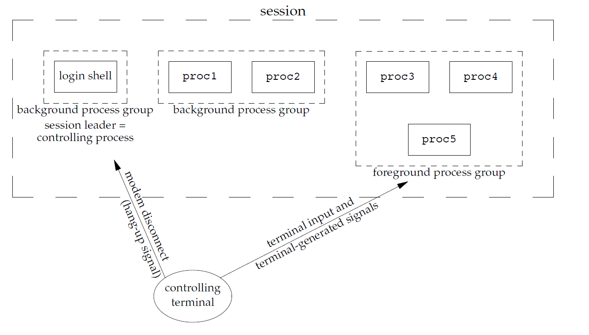
关系如图， 一个会话可以有一个控制终端，建立会话的被称为首进程，可以有一个或多个后台进程组合一个前台进程组，中断键被发给前台进程组所有进程

守护进程不受终端影响，默默的在后台服务于系统/某个用户，并且不与终端进行交互。
创建一个守护进程的流程：
* umask(0)，这是为了和继承来的屏蔽字区分开。
* 调用fork，然后令父进程exit(使终端认为指令执行完毕，同时满足设置session不是组长的要求)
* 调用setsid创建新的session(这样没有控制终端)
* 将当前目录更改为根目录(也是为了分离以前关系)
* 关闭不需要的描述符
* **可选**，有些会打开/dev/null使其拥有0 1 2描述符，防止交互

创建守护进程的核心就在于要一个不是进程组组长的终端调用setsid，并且，要将守护进程和以前的进程彻底分离，其他特性和基本的进程没有什么区别。

### 4.进程、线程状态查看

* ps指令查看进程(快照)
    首先介绍一下Linux上的进程状态：
    * R(Running)：可执行状态，包括就绪态和运行态，也就是可执行队列。
    * S(Interruptible/Sleep)：可以被中断的睡眠态，在等待某件事发生
    * D(Uniterruptible)：不可中断的睡眠态，不响应各种异步信号等。这个状态可以用来避免内核的某些流程被打断，比如再做IO操作时
    * T(Traced/Stopped)：表示暂停或者跟踪状态，可以通过发送SIGSTOP(不可捕获)使进程暂停，发送SIGCONT可以恢复进程  
    跟踪是指进程被跟踪他的进程暂停，如gdb调试时，停在断点处，可以通过ptrace系统调用进行操作
    * X(Exit)：退出状态，即将被销毁，如果是分离状态，则不会持有task_struc
    * Z(Zombie)：退出状态，进程称为僵尸进程，等待回收资源

    可以利用ps命令查看系统当前运行的进程(快照)：
    * a,-A,-e显示所有进程
    * -w显示加宽，以显示较多信息
    * -au显示终端下用户的所有程序
    * -aux列出所有的正在内存中的程序
    * -u 显示某用户的进程信息

    可以利用ps和grep配合，查找特定的进程

* top(性能分析)
    top类似win下的资源管理器，可以看到各种资源进程的占用情况

    这里参考一个网上的例子，便于理解各个参数：
    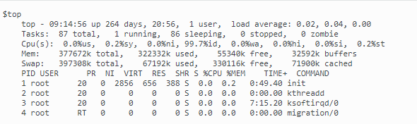
    * 第一行是时间，日期，在线用户，以及1分钟，5分钟，15分钟的CPU负载
    * 第二行是进程各个状态的统计信息
    * 第三行是统计CPU的总体信息
    * us(user)：用户态占比
    * sy(system)：内核态占比
    * ni(nice)：改变过优先级的占比
    * id(idle)：空闲时间占比
    * wa(wait)：等待时间占比
    * hi(hardware)：硬件中断占比
    * si(software)：软件占比  
    
    按1可以看每个CPU的占比
    * 第四行内存信息，total物理内存总量，used是使用的物理内存，free是空闲的，buffers用作内核缓存的物理量
    * 第五行是交换空间(虚拟内存)的总量，空闲，以及缓冲交换区总量
    * 最后是进程信息，一次是PID，用户，优先级，nice值，虚拟内存，物理内存，共享内存，CPU率和屋里内存率，最后是占用CPU的总时间和启动命令。
    
    这里有个很有意思的事情，Linux有Nice值和优先级两个来进行调度，那么他么是怎么进行配合的呢？

    实时优先级是0 ~ MAX_RT_PRO-1，nice值是MAX_RT_PRO ~ MAX_RT_PRO + nice_max，也就是nice值的程序比实时优先级的更低(数越小，优先级越高)。

* strace(跟踪系统调用)

    可以用strace来跟踪进程执行的系统调用和所接受的信号。
    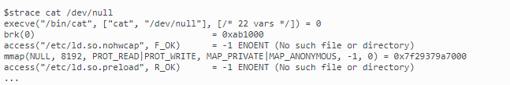
    每一行会输出一个系统调用，左边是系统调用函数，右边是返回值

    strace用法很多，这里只举几个：
    * -f：跟踪fork后的子进程
    * -F：跟踪vfork后的子进程
    * -o：输出到文件
    * -T：显示每次耗费时间
    * -tt：每次输出加上时间信息
    * -e trace = *：可以调整只输出某部分相关的系统调用
    * -p pid：跟踪PID
    
* pstack(跟踪进程栈)
  可以跟踪每个进程的栈变化，这样可以帮助我们知道程序的调用顺序，方便debug。

* 协程  
    协程是一种用户态的轻量级线程，协程的调度完全由用户控制。协程拥有自己的寄存器上下文和栈。协程调度切换时，将寄存器上下文和栈保存到其他地方，在切回来的时候，恢复先前保存的寄存器上下文和栈，直接操作栈则基本没有内核切换的开销，可以不加锁的访问全局变量，所以上下文的切换非常快。  

    协程的一大特点是不由内核调度，而是由程序进程调度的，因此调度的代价比较小


### 5.内存和IO
* free(查看可用内存)
    
    * 第一行表示内存总量，使用和空闲。然后是共享内存，缓冲大小(还没被写入磁盘的)，缓存大小(从磁盘读取备用的内容)
    * 第二行是从应用程序来看的，第一行是从OS角度来看的，从OS来说，buffers和cached都是被使用的，而对应用程序来说那两者都是可以使用的  
    * 最后一行是交换分区的信息，不再赘述
* iostat(监视IO子系统)
    可以方便的查看CPU/网卡等设备的活动情况，负载信息。
    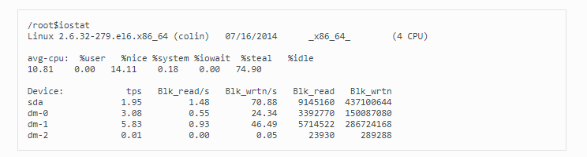
    输出如上，重点关注两个：
    * iowait：用于等待输入、输出完成时间的百分比
    * idle：空闲时间百分比  
    iowait可以帮助我们判断瓶颈是否在IO(等待占比是否过长)，idle可以帮助我们判断CPU是否存在瓶颈(空闲时间长时间很小)
* ls
    ls可以查看当前目录下的内容，-l输出详尽信息。
* du
    用来查看目录或文件所占用的磁盘大小，常用du -sh
    * -h以人类可读方式输出
    * -a显示目录和子目录文件占用
    * -s不显示子目录和文件
    * -c统计几个选项
* df
    用来查看文件系统整体的使用情况。

### 6.文件基本
* 文件属性  
    ```c
    int stat(const char * path, struct stat * buf);
    int fstat(int fildes, struct stat *buf);
    int lstat(const char * path, struct stat *restrict buf);
    int fstatat(int fd, const char *path, struct stat *buf, int flag);
    ```
    带l当文件是索引文件时，返回的是符号链接(指向另一个链接的项)的有关信息，f开头的，返回的是fd对应的信息。

* 文件权限  
    文件权限有9位，在stat中的st_mode字段，分别是用户、组、其他读写。
    ```c
    //更改权限
    int chmod(const char* pathname, mode_t mode);
    //fd版本
    int fchmod(int fd, mode_t mode);
    ```
    通过宏我们可以对每一位进行设置，权限分别为用户、用户组、其他组。
* 三个时间信息
    stat中有三个时间信息，分别为st_atime,st_mtime,st_ctime，都是timespec结构的。

    分别为：
    * st_atime：读取文件或执行文件时更改的，任何对inode的访问都会更改此值
    * st_mtime：写入文件时随文件内容更改
    * st_ctime：写入、更改所有者或链接设置时，随iNode更改而更改。只要stat出来的内容改变，ctime改变，也就是修改属性的时候改变

    具体来说，有三种情况：
    * 读文件，st_atime改变
    * 修改文件，三个都改变
    * 修改文件属性，st_ctime改变，其余不变

* inode
    因为存储文件的时候还需要顺带记录文件权限等信息，这也就是inode，stat调用读取的就是inode的信息。Linux允许多个文件名指向同一个inode，只有inode计数为0的时候，才会删除文件。
    调用link可以创建一个指向现有文件的连接。

* 用户ID  
    Linux有用户ID和组ID。在对文件进行操作的时候：* 首先检查用户ID是否为0(root)
    * 检查用户ID是否设置了对应位
    * 如果进程的进程组ID或附属组ID(Linux允许属于多个组)，则允许访问
    * 其他位被设置，则允许访问
    ```c
    //更改用户ID和组ID
    chown(const char* pathname, uid_t owner, gid_t group);
    ```
    通过chown我们可以对文件拥有者，如果设为-1，则不变。
* lsof(list open files)
    列出所有打开的文件，一般以root用户运行。

### 7.软连接
硬链接：建立inode和文件名之间的连接关系，`ln source_file_name new_file_name`

通过连接名->inode->block->sector

但是目录不能创建硬链接，并且不能跨分区创建

使用硬链接可以实现文件备份的功能，并且节省磁盘空间

软连接：又称符号链接，也就是快捷方式,`ln -s target_name soft_name`


软连接和硬链接都有自己的inode，硬链接是一个inode对应多个文件名，软连接有自己独立的inode，但是数据内容比较特殊

### 8.进程间通信
* 管道(pipe)
    1. 半双工
    2. 只能用于有亲缘关系进程间的通信，通常是fork一个子进程，然后利用管道在二者之间通信。
    ```c
    int pipe(int fd[2]);
    ```
    当管道建立成功，会创建两个文件描述符，fd[0]为读打开，fd[1]为写打开。

    一般是fork前创建pipe，然后写端关闭读，读端关闭写。其实可以互相不关闭，但是即使不关闭，两个进程也不敢互相收发，因为不知道什么时候读取的是自己发出去的数据了。具体见[won't close pipe](https://stackoverflow.com/questions/11599462/what-happens-if-a-child-process-wont-close-the-pipe-from-writing-while-reading)

* 命名管道(FIFO)
    1. 与pipe不同，不相关的进程也能通过FIFO交换数据
    2. FIFO有路径名相关联，确实存在于文件系统中
    ```c
    int mkfifo(const char* path, mode_t)
    //因为类似文件，我们用open来打开
    int open(const char *pathname, int flags);
    ```
    FIFO类似使用文件在进程中通信，但是和pipe类似，数据读出时，FIFO会清楚数据。

    并发写时，长度不能超过PIPE_BUF字

    FIFO主要用来解决pipe不能用于没有亲缘关系的进程通信的问题

* XSI IPC相似之处(消息队列，信号量，)  
    * 多个IPC汇聚方式：
        * 指定键IPC_PRIVATE，创建一个新的IPC结构，将返回的标识符放在某处，供客户进程使用
        * 在公共头文件中指定一个都认可的键
        * 认同一个路径名和项目ID(0-255)，调用`key_t ftok(const char* path, int id);`创建一个key_t类型的键

    * 缺点
        * 在系统范围内有效，没有引用计数，有可能会一直存在于系统之中
        * 在文件系统中没有名字不能用各种文件的操作
        * 没有fd，多路复用难以应用在此
* 消息队列  
    消息队列，是消息的链接表，存放在内核中。一个消息队列由一个标识符（即队列ID）来标识。
    1. 面向记录，消息具有特定的格式和优先级
    2. 独立利于发送和接收进程
    3. 可以随机查询，不一定先入先出，可以按类型取消息
    ```c
    #include <sys/msg.h>
    // 创建或打开消息队列：成功返回队列ID，失败返回-1
    int msgget(key_t key, int flag);
    // 添加消息：成功返回0，失败返回-1
    int msgsnd(int msqid, const void *ptr, size_t size, int flag);
    // 读取消息：成功返回消息数据的长度，失败返回-1
    int msgrcv(int msqid, void *ptr, size_t size, long type,int flag);
    // 控制消息队列：成功返回0，失败返回-1
    int msgctl(int msqid, int cmd, struct msqid_ds *buf);
    ```

    消息发送指针ptr指向要求是以`long int`开头的消息结构，用来确定成员的消息类型，msgrcv中的ptr类似

    linux用MSGMAX和MSGMNB来限制消息的长度和消息队列的长度

* 信号量(semaphore)  
    最简单的信号量是只能取 0 和 1 的变量，这也是信号量最常见的一种形式，叫做二值信号量。而可以取多个正整数的信号量被称为通用信号量。
    Linux 下的信号量函数都是在通用的信号量数组上进行操作，而不是在一个单一的二值信号量上进行操作。
    ```c
    #include <sys/sem.h>
    // 创建或获取一个信号量组：若成功返回信号量集ID，失败返回-1
    int semget(key_t key, int num_sems, int sem_flags);
    // 对信号量组进行操作，改变信号量的值：成功返回0，失败返回-1
    int semop(int semid, struct sembuf semoparray[], size_t numops);  
    // 控制信号量的相关信息
    int semctl(int semid, int sem_num, int cmd, ...);
    ```
    当semget创建新的信号量集合时，必须指定集合中信号量的个数（即num_sems），通常为1； 如果是引用一个现有的集合，则将num_sems指定为 0 。
    在semop函数中，sembuf结构的定义如下：
    ```c
    struct sembuf
    {
        short sem_num; // 信号量组中对应的序号，0～sem_nums-1
        short sem_op;  // 信号量值在一次操作中的改变量
        short sem_flg; // IPC_NOWAIT不阻塞，返回EAGAIN, SEM_UNDO
    }
    ```
* 共享内存  
    共享内存允许两个或多个进程共享一个给定的存储区，因为数据不要在各个进程复制，所以是最快的一种IPC。
    1. 速度快
    2. 允许多个进行操作，因此需要同步措施
    ```c
    #include <sys/shm.h>
    // 创建或获取一个共享内存：成功返回共享内存ID，失败返回-1
    int shmget(key_t key, size_t size, int flag);
    // 连接共享内存到当前进程的地址空间：成功返回指向共享内存的指针，失败返回-1,一般addr为0，由操作系统进行选取
    void *shmat(int shm_id, const void *addr, int flag);
    // 断开与共享内存的连接：成功返回0，失败返回-1
    int shmdt(void *addr);
    // 控制共享内存的相关信息：成功返回0，失败返回-1
    int shmctl(int shm_id, int cmd, struct shmid_ds *buf);
    ```
    当调用共享内存结束后，调用shmdt断开连接，但是这并不在系统中删除共享内存，只有当以IPC_RMID命令的调用shmdt才会删除

* 信号  
    信号用于通知进程发生了某种情况，进程可以忽略，按默认方式处理或者捕获该信号，设置自己的处理函数。
    常见的信号：
    * SIGINT(程序终止，在用户输入INTR字符时发出的)  
    * SIGKILL(立即结束程序运行，不能被捕获)  
    * SIGSTOP(停止进程的运行，不能被捕获)  
    * SIGTERM(程序结束信号，可以被捕获，kill默认产生这个)  
    * SIGSEGV(试图访问未分配给自己的内存, 或试图往没有写权限的内存地址写数据)  
    * SIGCHLD(子进程结束时, 父进程会收到这个信号)  
    * SIGALRM(时钟定时信号, 计算的是实际的时间或时钟时间. alarm函数使用该信号)  
    * SIGPIPE(对于已经关闭的TCP链接，发送一次，客户会收到RST响应，再发一次，系统会返回SIGPIPE，默认的操作是停止运行，可以设置SIG_IGN忽视)  
        对于服务器，如果比较繁忙，没能按时发出数据，有可能会发送超过一个包到已经关闭的链接，因此要对这个信号信息处理

    ```c
    //设置信号处理函数, handler可以为SIG_IGN忽略，SIG_DFL系统默认，以及函数指针
    typedef void (*sighandler_t)(int);
    sighandler_t signal(int signum, sighandler_t handler);】
    //发送信号到进程组或进程
    int kill(pid_t pid, int signo);
    //发送信号给自己
    int raise(int signo);
    ```
    当kill的pid>0时，发送给pid，==0时，发送给同一进程的所有进程组，<0时发送给发送给abs(pid)进程组，==-1，发送给有权限发送信号的所有进程

    还可以通过sigaction进行安装
    ```c
    int sigaction(int signum, const struct sigaction *act, struct sigaction *oldact);
    ```
    其中：
    * signum：要操作的信号
    * act：对信号新的处理方式
    * oldact：原来的方式  
    sigaction的结构如下：
    ```c
    struct sigaction {
        void (*sa_handler)(int); //信号处理函数
        void (*sa_sigaction)(int, siginfo_t *, void *); //替代的信号处理函数，flags为SA_SIGINFO启用这个
        sigset_t sa_mask; //信号处理时需要屏蔽的信号
        int sa_flags; //一些标志
    }
    ```

    如果是可靠信号，那么屏蔽之后，如果触发N次，恢复后会执行N次信号处理，如果是不可靠信号，那么最多只会注册一次。

* 套接字
    socket也可以用于进程间通信，具体见网络部分

### 9.虚拟内存相关
* 虚拟内存用途
    * 把主存看做是磁盘的缓存，在主存中只保留活动区域，并且根据需要在主存和磁盘交换数据，高效的使用主存
    * 为每个进程提供了一致的地址空间
    * 保护了每个进程的地址空间不被其他破坏

* 页表  
    为了实现虚拟内存，我们需要一种方式，能够知道虚拟页是否在物理页中，不命中的话，还需要实现置换算法。

    这些功能通过操作系统、MMU(内存管理单元)以及内存中的页表实现的。页表将虚拟页映射为内存页，每次MMU需要翻译时会读取页表，操作系统负责维护页表

    页表就是由页表条目(PTE，除了物理页号外，还会有一些权限标志)构成的数组

    页表也有着自己的一个缓存，叫做TLB。

* 多级页表
    假设是32位，4字节的PTE，页面大小为常见的4K，那么一个进程就要有4MB的页表常驻在内存中(即使大部分内容都是无效的)

    为了解决这个问题，将PTE进行分级，这样下级页表中无效的表项在上一级就可以指出，有效的减少了页表占用的内存

* 缺页中断  
    malloc和mmap等内存分配函数实际上只是建立了虚拟页表，并没有分配对应的物理内存，而是当CPU需要访问时，产生缺页中断再进行页面调度

    缺页中断会通过调度算法来决定将哪些页面换出，作为替换。(LRU, LFU)

    缺页中断是软中断的一种，和普通的中断一样，需要
    * 保护现场
    * 分析中断原因
    * 转入缺页中断处理程序
    * 恢复CPU  
    但是，和平常不一样的是，缺页中断返回的是产生中断的指令，而不是下一条指令。

* fork和vfork  
    fork会创建一个和当前进程几乎一样的进程，只是子进程返回的是0。在过去，fork会将父进程的资源都复制给子进程，因此效率很低。因为fork之后通常就exec导入新的程序了，复制毫无意义。

    后来就引入了写时复制，子进程拷贝父进程的页表原样副本，并且标记位写时复制，这样代价就比复制所有资源小得多。

    vfork实际上是没有写时复制的一个中间产物，为了避免无谓的复制，vfork会休眠父进程直到子进程终止或者运行一个新的可执行文件，在过程中，父子进程共享地址空间和页表。通过这种方式避免了拷贝。

* 结构体对齐  
    * 对齐的原因  
        主要是因为32位的Intel处理器通过总线访问，一次读取32个bit，如果不对齐的话，可能会造成两次总线读写，浪费时间。
    
    * 对齐原则
        * 结构体变量的起始地址能够被其最宽的成员大小整除
        * 结构体每个成员相对于起始地址的偏移能够被其自身大小整除，如果不能则在前一个成员后面补充字节
        * 结构体总体大小能够被最宽的成员的大小整除，如不能则在后面补充字节
        * 取上述规则和指定大小的最小值，一般为4

* 页面置换算法
    * FIFO(先进先出)：最近刚访问的，将来访问的概率大，用队列即可实现
    * LFU(最不经常访问算法)：数据过去被访问过多次，将来被访问的频率也很高(感觉不太符合局部性的原理？很久之前多次访问的，岂不是很难被置换出去了)，用引用计数可以实现
    * LRU(最近最少使用)：最近被访问过，将来被访问的几率高。用栈可以实现，每次命中移动到栈底，每次替换栈顶。对热点数据命中率高，但是大量偶发访问时，内存中存放大量冷数据
    * LRU-K(最久未使用K次淘汰)：避免偶发访问造成的缓存污染问题，当访问次数达到K次时，才访问缓存

* 动态内存分配器
    * 隐式空闲链表：在链表块头部添加标志，表明是否是空闲，这种方式，每次查找合适的空闲块需要O(n)的时间
    * 显式空闲链表：将空闲块单独开辟一个链表，查找时间为O(empty)
    * 分离空闲链表：更近一步，将空闲链表进行分类，加速寻找空闲链表的时间，具体有如下做法
        * 简单分离存储：将大小类内的大小固定，也就是同一大小类内含有相等大小的块，不分割也不合并，实现简单，但是内部碎片大。
        * 分离适配：找到第一个适配的，进行分割，分割后插入适当的空闲链表中
        * 伙伴系统：以2^m次方开始，二分的递归分割这个块(因为是二分，所以叫伙伴)，直到分配到满足我们要求的块。合并的时候，很容易递归的和自己的伙伴合并，直到遇到已经分配的伙伴。伙伴系统快速搜索和快速合并，但是显然有内部碎片问题。

* 内存映射
    ```c
    void *mmap(void *addr, size_t length, int prot, int flags, int fd, off_t offset); 
    int munmap(void *addr, size_t length);
    ```
    * addr：需要映射的内存起始地址，通常为NULL，让系统自动选定，映射成功会返回该地址
    * length：文件多长进行映射
    * prot：保护方式，可执行、读、写、存取等
    * flags：MAP_SHARED会进行写回，MAP_PRIVATE写入操作会产生一个映射文件的复制，不会写回给原始内容，MAP_ANONYMOUS匿名映射，MAP_DENYWRITE只允许映射方式写入，MAP_LOCKED不会被置换出去
    * fd：映射到内存的文件的描述符
    * offset：偏移量
  
    内存映射可以减少拷贝次数，因为通过read等需要将磁盘文件读到页缓存，再从页缓存拷贝到用户的buffer中，而映射可以直接通过指针操作mmap映射的内存，效率更高。

### 10.页缓存、页回写、内存映射

* 为什么要有页缓存  
    页缓存的主要原因是因为磁盘和和内存访问速度有着巨大的差别，为了加快从磁盘读取文件的速率而设计的。具体来说，当要读取磁盘文件的时候，先在page cache中查找，命中的话就不需要再从磁盘读取了。  
    对于写操作，有三种策略，不缓存写操作/更新缓存，写入磁盘(写透缓存)/通过标记脏页，定时回写

* 操作系统怎么设计的  
    Linux采用通过两个双向链表实现LRU-2进行缓存回收策略，通过radix tree(压缩版的prefix tree，如果trie-tree的子节点是父节点的唯一孩子，那么就会进行合并)用页索引来管理已经缓存了的页面

### 11.定时器

* 时间轮  
      
    在早期只支持低精度的时钟，系统通过定时器中断更新时间轮(多级时间轮，图示只有一级)

* 红黑树  
    在后来支持了高精度的时钟，内核该用了红黑树的方式进行定时器管理，采用了基于事件触发的方式，将下次触发时间设置为红黑树中最早到期的timer的时间。

* 红黑树和时间轮对比，为什么高精度弃用了时间轮  
    因为在多级时间轮的操作中，虽然大部分时间为O(1)的复杂度，但是当进位发生时，有可能坏至O(N)的定时器迁移时间，这种不稳定极大的影响了定时器的精度。  
    而红黑树方式采用时间触发方式，能够实现较为精确的定时  
[时间轮介绍](http://oneyearago.me/2019/10/24/linux_timer/)  
[选用红黑树的原因](https://www.cnblogs.com/arnoldlu/p/7078266.html)
## 网络

### 1.TCP状态机
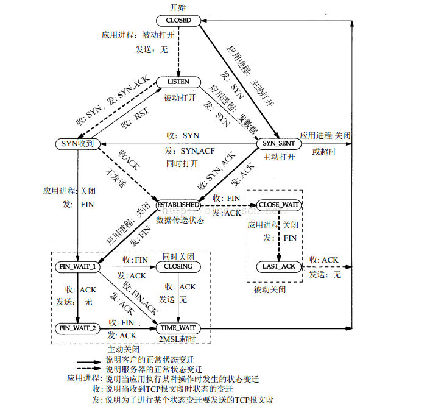
TCP状态图如图所示。

三次握手：客户发送SYN，服务回复SYN-ACK，客户回复ACK。  
通过三次握手，客户和服务互相验证了各自的收发没有问题。

四次挥手：客户发起FIN，进入FIN_WAIT_1，服务器收到后，回复ACK，进入CLOSE_WAIT，此时进入半关闭状态，客户流向服务端的那端已经被关闭。接着客户收到ACK后进入，FIN_WAIT_2状态，收到FIN后，回复ACK，进入TIME_WAIT状态，等待2MSL后关闭。  
通过四次挥手，数据流的两个方向均被关闭。

* **TIME_WAIT状态**：  
    在主动发起关闭的一方，收到两个FIN后，有一个TIME_WAIT状态，停留的时间为2MSL(最长分节生命期)。

    TIME_WAIT主要解决两个问题：
    * 可靠实现TCP全双工连接的终止
    * 允许老的分节在网络中消逝  

    对于第一个来说，服务器在发送FIN，试图把发端也关闭后，会进入LAST_ACK等待最后一个ACK，此时TIME_WAIT状态会在服务器重传FIN时，重新回复ACK，帮助服务器关闭。

    此外TIME_WAIT能够保证旧的IP数据报已经在网络中消失，新建立的连接不会收到过去的报文。

* **LAST_ACK**：
    这个状态，服务器等待最后一个ACK后就可以关闭，如果没有收到，会进行重传，此时有几种情况：
    * C端处于TIME_WAIT，那么会回复ACK
    * 已经CLOSED了，那么会认为连接错误，发送RST，S收到后CLOSED
    * C端已经不再了，S会不断重传，直到重传超时，进入CLOSED

### 2.tcpdump(抓包)

tcpdump可以截获网络数据包，并对其进行分析。
* -i：指定网卡
* host：指定特定的主机和本机之间的通信包
* src host：指定特定来源
* dst host：指定特定的目标地址
* port：指定端口
* tcp/udp：指定传输层
* -c：抓包数量
* -s 0：抓完整数据包
* -w：保存到本地(带缓冲)

### 3.网络状态和防火墙(netstat/ifconifg/iptables)

* netstat用来查询网络相关的信息
    * -a：查看所有端口(监听以及未监听)
    * -t：TCP端口
    * -l：所有监听服务状态
    * -u：UDP端口
    * -p：显示相关连接的程序名
    * -c：每隔固定时间执行

* ifconifg获取和修改网络接口配置  
    ifconifg [网络设备] [参数]  
    直接调用ifconifg可以看到所以网卡的MAC地址，MTU，广播地址等  
    * up/down：启动、关闭设备
    * arp：设置网卡是否支持arp
    * -a：显示所有接口信息
    * add/del：给指定网卡配置/删除IPv6地址
    * mtu：设置最大传输单元
    * netmask：子网掩码
    * address：设置IPv4地址

### 4.socket API(重点)

* 连接建立/销毁相关  
    连接建立/销毁即三次握手过程和四次挥手，主要有几个函数：
    * socket：建立套接字描述符sockfd
    * bind：绑定地址到套接字
    * listen：设置为监听套接字(默认为主动)
    * accept：从就绪队列中获取，并且返回连接的sockfd
    * connect：用于客户端和服务器建立连接
    * close：将套接字描述符引用减一，为0时会关闭套接字
    
    接下来按顺序介绍每个函数：  
    * socket
        ```c
        //返回：若成功则为非负描述符sockfd，若出错则为-1
        int socket (int family, int type, int protocol);
        ```
        调用socket可以创建一个套接字  
        family常用的为AF_INET(IPv4)和AF_INET6(IPv6)  
        type常用的有SOCK_STREAM(配合TCP)和SOCK_DGRAM(配合UDP)  
        protocol选择传输层协议，有IPPROTO_TCP和IPPROTO_UDP
        
        `socket(AF_INET, SOCK_STREAM | SOCK_NONBLOCK | SOCK_CLOEXEC, 0);`  
        可以直接通过socket的type设置非阻塞和exec关闭，也可以创建之后通过fcntl设置
    * bind
        ```c
        //绑定本地地址到套接字
        int bind(int socket, const struct sockaddr *address, socklen_t address_len);
        ```
        主要是sockaddr结构，这是通用套接字格式，一般我们操作sockaddr_in：
        ```c
        struct sockaddr_in{
         uint8_t sin_len; //带符号8位整数地址结构长度
         sa_family_t sin_family; //协议族，IPv4为AF_INET
         in_port_t sin_port; //端口号
         struct in_addr sin_addr; //32位IPv4网络字节序地址
         char sin_zero[8];      //填充对齐位，未使用
        };
        ```
    * listen
        ```
        int listen(int sockfd, int backlog)
        ```
        backlog指定了套接字排队的最大连接个数。
    * accept
        ```c
        int accept (int sockfd, struct sockaddr *cliaddr, socklen_t *addrlen);
        ```
        服务器从已完成连接队列中取出一个连接，并且返回一个全新的描述符，cliaddr是客户的地址信息。
    * connect
        ```c
        //返回：若成功则为0，若出错则为-1
        int connect(int sockfd, const struct sockaddr *servaddr, socklen_t addrlen);
        ```
        对servaddr发起连接，如果没有收到SYN响应，会进行重传，如果响应时收到RST，说明服务器没有在该端口监听，errno会设置为ECONNREFUSED，如果客户发出SYN不被接收，errno会被设为EHOSTUNREACH。

        上述描述的是TCP调用connect的场景，实际上，UDP也是可以调用的，此时只是起到记录对端IP地址和端口号的作用。

        不调用connect时，情况为建立连接，发送报文，断开连接，建立连接，再发送。。。调用之后变为建立连接，发送，发送。。。，断开，提高了效率，此外，UDP可以调用多次connect。
    * close
        ```c
        int lcose(int sockfd);
        ```
        将套接字引用-1，如果为0，关闭套接字，>0，则不会。
    * shutdown
        ```c
        int shutdown(int sockfd, int howto); 
        ```
        可以不顾close引用数量的限制，并且可以关闭读端或者写端
* 输入/输出(五组)  
    * read、write(unistd.h)
        ```c
        size_t read ( int fd, void *buf, size_t count); 
        size_t write ( int fd, const void * buf, size_t count);
        ```
        将buf里的文件写入fd中，count为需要读取或者写入的字节数，返回值为成功操作的字节数。

        因为Linux中所有设备都能看成文件，所以也可以用来操作sockfd

    * recv、send(sys/socket.h)
        ```c
        ssize_t recv(int sockfd, void* buff, size_t nbytes, int flags);
        ssize_t send(int sockfd, const void* buff, size_t nbytes, int flags);
        ```
        前三个意义和上节相同，当flags取0时，等价于上节的两个。但是可以通过设置flags设置为非阻塞等操作

        如果连接终止，会返回0，否则会返回SOCKET_ERROR错误
    * recvfrom、sendto(UDP)
        ```c
        ssize_t recvfrom(int sockfd, void* buff, size_t nbytes, int flags, struct sockaddr* from, socklent_t* addr_len);
        ssize_t sendto(int sockfd, void* buff, size_t nbytes, int flags, struct sockaddr* to, socklen_t addrlen);
        ```
        前三个参数同上，后两个填入的是对端的地址和结构长度

        他们可以用于TCP，但是通常不这么做，因为TCP建立连接创建了新的套接字，带有了信息，没必要
    * readv、writev
        ```c
        ssize_t readv(int filedes, const struct iovec *iov, int iovcnt);
        ssize_t writev(int filedes, const struct iovec *iov, int iovcnt);
        ```
        利用iovec进行分块读写，iovec里用base和len来表示每块的范围
* 网络模型
    * Reactor模式
        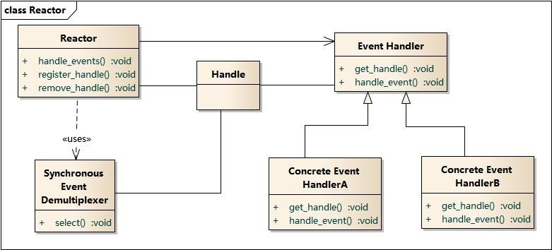
        Reactor包含以下结构：
        * Reactor：反应器，需要有以下功能
            * 注册和删除关注的事件
            * 事件循环
            * 事件到来时，能够执行对应的回调函数
        * 多路复用器：操作系统提供的时间多路分解器(select/poll/epoll)
        * Handle：句柄，用来标识socket连接或者打开的文件
        * Event Handler：事件处理器

        业务流程和时序如图：
        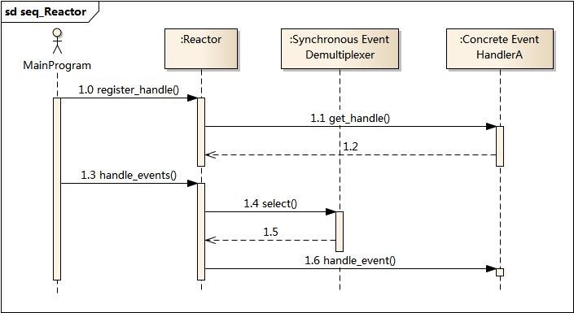

        * 应用启动，注册事件
        * 进入事件循环
        * 事件到来，执行回调

    * Proactor模式  
        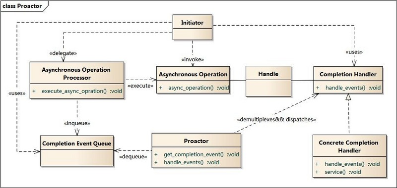  
        Proactor包含以下结构
        * Proactor：主动器，为程序提供事件循环，从完成事件中取出异步结构，分发给后序处理的逻辑
        * Asynchronous Operation Processor：异步操作处理器，负责执行异步操作，由操作系统实现
        * Asynchronous Operation：异步操作
        * Handle：句柄
        * Completion Handler：完成事件接口，一般是回调函数
        * Concrete Completion Handler：完成事件处理逻辑

        业务流程和时序图：
        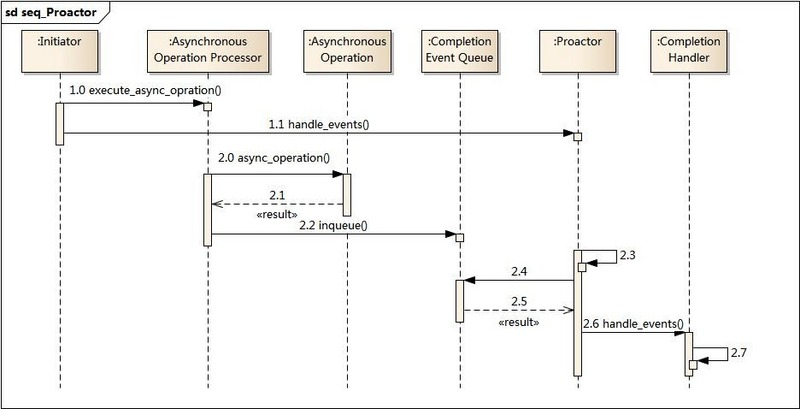

        * 调用异步处理接口，调用后其他操作可以并发进行
        * 启动Proactor，进入事件循环，等待完成事件
        * 异步操作将完成结构放入完成事件队列
        * 主动器从完成事件队列取出事件，分发回调

### 5.IO复用
* select
    ```c
    int select(int maxfdp, fd_set *readfds, fd_set *writefds, fd_set *errorfds, struct timeval *timeout)
    ```
    select是最初的复用函数，参数分别为
    * 最大要测试描述符+1
    * 读、写、错误描述符集合
    * 等待时间(可以实现us定时器)，NULL为阻塞到有事件，0为不等待的轮询

    有几个函数可以用来设置fd_set，FD_ZERO，FD_SET，FD_CLR，FD_ISSET，并且每次需要重新SET

    返回时我们需要遍历每个集合来找到响应的事件

    因为select返回会将没有响应的置0，我们感兴趣的事件可能被置位，所以每次需要重新设置
* poll
    ```c
    int poll(struct pollfd * fdarray, unsigned long nfds, int timeout);
    ```
    poll的参数含义分别为
    * 等待的集合，pollfd结构为：
    ```c
    struct pollfd{
         int fd; //描述符
         short events; //兴趣事件
         short revents; //等待事件
    };
    ```
    * 关心描述符的个数
    * 等待事件，毫秒

    和select相比，poll把关注和回复分开了，因此不再需要每次重新设置
* epoll
    ```c
    int epoll_create(int size)；//创建一个epoll的句柄，size用来告诉内核这个监听的数目一共有多大
    int epoll_wait(int epfd, struct epoll_event * events, int maxevents, int timeout);
    ```
    epoll通过一个文件描述符管理多个描述符，返回epoll的描述符

    ```c
    int epoll_ctl(int epfd, int op, int fd, struct epoll_event *event);
    ```
    epoll_ctl用来更改epoll里的event集合
    * epoll描述符
    * op表示操作，可以是EPOLL_CTL_ADD，EPOLL_CTL_DEL和EPOLL_CTL_MOD
    * fd是要监听的fd
    * event是要监听的事件，同时可以设置ET和LT

    ```c
     int epoll_wait(int epfd, struct epoll_event * events, int maxevents, int timeout);
    ```
    进行事件等待，events返回等待成功的时间，maxevents告诉events的个数，timeout等待时间精度为ms。

    **LT和ET**：LT只有可行，就会重复提醒，ET只有当状态变为可行时，会提醒。  
    ET只支持非阻塞IO  
    因为二者的特点，LT可以不取完所有数据，但是ET必须操作到不能再次操作(errno为EAGAIN)，也因此，ET的触发次数更少

* epoll为什么高效
    * select/poll每次需要传递所有/要监控的fd给系统调用(这意味着每次都要将fd列表拷贝到内核态，很低效)，而epoll_wait时，不需要这步，因为之前已经通过epoll_ctl进行更改感兴趣的fd了。
    * epoll以红黑树保存fd在内核的cache里，因此有着高性能的插入、查找等操作
    * epoll通过设置回调函数，使就绪事件自动加入到就绪list中，因此每次只需要拷贝少许的就绪事件到用户态即可，而select和poll每次返回还得进行O(n)的遍历才能得到激活的事件。

* epoll源码  
    * eventpoll  
        ```c
        struct eventpoll {
        spin_lock_t lock; //对本数据结构的访问
        struct mutex mtx; //防止使用时被删除
        wait_queue_head_t wq; //sys_epoll_wait() 使用的等待队列
        wait_queue_head_t poll_wait; //file->poll()使用的等待队列
        struct list_head rdllist; //事件满足条件的链表
        struct rb_root rbr; //用于管理所有fd的红黑树（树根）
        struct epitem *ovflist; //将事件到达的fd进行链接起来发送至用户空间
        }
        ```
        每创建一个epollfd，就会有一个对应的eventpoll对象生成，他用来管理注册到这上面的事件，在epoll_create时创建
    
    * epitem
        epitem封装了关注的事件，结构如下
        ```c
        struct epitem {
            struct rb_node rbn; //用于主结构管理的红黑树
            struct list_head rdllink; //事件就绪队列，指向eventpoll的rdllink
            struct epitem *next; //用于主结构体中的链表
            struct epoll_filefd ffd; //这个结构体对应的被监听的文件描述符信息
            int nwait; //poll操作中事件的个数
            struct list_head pwqlist; //双向链表，保存着被监视文件的等待队列，功能类似于select/poll中的poll_table
            struct eventpoll *ep; //该项属于哪个主结构体（多个epitm从属于一个eventpoll）
            struct list_head fllink; //双向链表，用来链接被监视的文件描述符对应的struct file。因为file里有f_ep_link,用来保存所有监视这个文件的epoll节点
            struct epoll_event event; //注册的感兴趣的事件,也就是用户空间的epoll_event
        }
        ```
    总的来说，内核通过eventpoll用红黑树组织注册的事件形成的eptiem
    
    * 初始化  
        epoll是内核的一个module，内核启动的时候，会初始化这个module
        ```c
        static int __init eventpoll_init(void)
        {
        mutex_init(&pmutex);

        ep_poll_safewake_init(&psw);

        epi_cache = kmem_cache_create("eventpoll_epi", sizeof(struct epitem), 0, SLAB_HWCACHE_ALIGN|EPI_SLAB_DEBUG|SLAB_PANIC, NULL);

        pwq_cache = kmem_cache_create("eventpoll_pwq", sizeof(struct eppoll_entry), 0, EPI_SLAB_DEBUG|SLAB_PANIC, NULL);

        return 0;
        }
        ```
        初始化时，主要是通过slab层，创建了两个类的cache，从而加速之后分配这两个类的时间
    
    * epoll_ctl
        在创建了eventpoll之后，可以调用epoll_ctl进行操作。首先会在对应的epfd的红黑树中查找是否已经有这个了，然后进行对应的操作。
    * ep_insert
        如果是添加新的事件，会通过初始化的cache进行分配epollitem对象，然后进行初始化，将对象加入到指定的等待队列中，并且和他的事件发生时的回调函数，硬件中断会调用该回调函数(主要功能是文件添加到就绪队列)

epoll整体流程如图
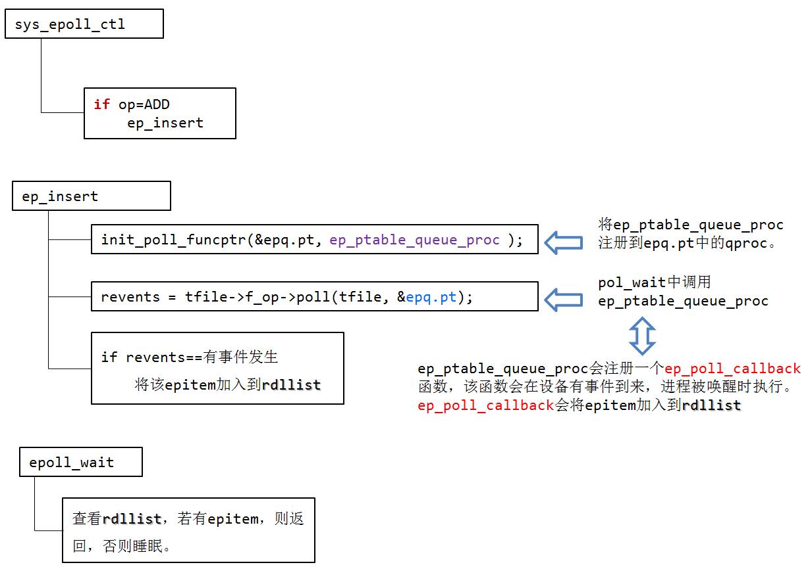

`TODO(jingyu):需要更新答案`
### 5.HTTP和HTTPS的区别(优缺点，不同)
HTTP 有以下安全性问题：
* 通信使用明文，内容可能会被窃听；
* 不验证通信方的身份，因此有可能遭遇伪装；
* 无法证明报文的完整性，所以有可能已遭篡改。

HTTPs 并不是新协议，而是 HTTP 先和 SSL（Secure Socket Layer）通信，再由 SSL 和 TCP 通信。通过使用 SSL，HTTPs 提供了加密、认证和完整性保护。
认证
通过使用 证书 来对通信方进行认证。证书中有公开密钥数据，如果可以验证公开密钥的确属于通信方的，那么就可以确定通信方是可靠的。

数字证书认证机构（CA，Certificate Authority）颁发的公开密钥证书，可以通过 CA 对其进行验证。
进行 HTTPs 通信时，服务器会把证书发送给客户端，客户端取得其中的公开密钥之后，就可以开始加密过程。

HTTPS在三次握手后，要进行SSL进行协商加密使用的秘钥，且HTTP用80，HTTPS用的 是443端口。

使用HTTPS需要SSL，延时更高，并且需要购买CA证书，且占用CPU资源更高，因此应该有选择的在需要加密的时候才选用HTTPS协议。

https://www.cnblogs.com/sunsky303/p/10628894.html

### 6.HTTP返回码
2XX 成功  
200 OK  
204 No Content：请求已经成功处理，但是返回的响应报文不包含实体的主体部分。一般在只需要从客户端往服务器发送信息，而不需要返回数据时使用。  
206 Partial Content  

3XX 重定向  
301 Moved Permanently：永久性重定向  
302 Found：临时性重定向  
303 See Other  
注：虽然 HTTP 协议规定 301、302 状态下重定向时不允许把 POST 方法改成 GET 方法，但是大多数浏览器都会把 301、302 和 303 状态下的重定向把 POST 方法改成 GET 方法。  
304 Not Modified：如果请求报文首部包含一些条件，例如：If-Match，If-ModifiedSince，If-None-Match，If-Range，If-Unmodified-Since，但是不满足条件，则服务器会返回 304 状态码。  
307 Temporary Redirect：临时重定向，与 302 的含义类似，但是 307 要求浏览器不会把重定向请求的 POST 方法改成 GET 方法。  

4XX 客户端错误  
400 Bad Request：请求报文中存在语法错误  
401 Unauthorized：该状态码表示发送的请求需要有通过 HTTP 认证（BASIC 认证、DIGEST 认证）的认证信息。如果之前已进行过一次请求，则表示用户认证失败。

### 7.浏览器输入URL发生的事，用到了哪些层
浏览器中输入URL，首先浏览器要将URL解析为IP地址，解析域名就要用到DNS协议，首先主机会查询DNS的缓存，如果没有就给本地DNS发送查询请求。DNS查询分为两种方式，一种是递归查询，一种是迭代查询。如果是迭代查询，本地的DNS服务器，向根域名服务器发送查询请求，根域名服务器告知该域名的一级域名服务器，然后本地服务器给该一级域名服务器发送查询请求，然后依次类推直到查询到该域名的IP地址。DNS服务器是基于UDP的，因此会用到UDP协议。  

得到IP地址后，浏览器就要与服务器建立一个http连接。因此要用到http协议，http协议报文格式上面已经提到。http生成一个get请求报文，将该报文传给TCP层处理。如果采用https还会先对http数据进行加密。TCP层如果有需要先将HTTP数据包分片，分片依据路径MTU和MSS。TCP的数据包然后会发送给IP层，用到IP协议。IP层通过路由选路，一跳一跳发送到目的地址。当然在一个网段内的寻址是通过以太网协议实现(也可以是其他物理层协议，比如PPP，SLIP)，以太网协议需要直到目的IP地址的物理地址，有需要ARP协议。

### 8.GET和POST的区别

GET：获取资源  
POST：传输实体主体  
POST 主要目的不是获取资源，而是传输实体主体数据。
GET 和 POST 的请求都能使用额外的参数，但是 GET 的参数是以查询字符串出现在 URL中，而 POST 的参数存储在实体主体部分。

GET 的传参方式相比于 POST 安全性较差，因为 GET 传的参数在 URL 是可见的，可能会泄露私密信息。并且 GET 只支持 ASCII 字符，如果参数为中文则可能会出现乱码，而 POST 支持标准字符集。


### 9.TCP
这部分在计网总结中有着很详细的介绍，刚看完不就，这里不再赘述了


## 脚本工具awk，sed，cat)
### 1.cat
cat用来连接文件或标准输入输出，常用来显示内容，或者拼起来显示，常和重定位配合

cat[选项][文件]

主要三个用法：
* cat filename显示一整个文件
* cat > filenme创建新文件
* cat file1 file2 >file合并两个文件

参数如下：
* -A：显示所有
* -b：对非空行显示行号
* -E：每行结束显示$
* -n：输出行号
* -s：一行空白替换两行以上的
  


## 编程语言
* static作用是什么？在C和C++中有何区别？  
    * static可以修饰局部变量（静态局部变量）、全局变量（静态全局变量）和函数，被修饰的变量存储位置在静态区。对于静态局部变量，相对于一般局部变量其生命周期长，直到程序运行结束而非函数调用结束，且只在第一次被调用时定义；对于静态全局变量，相对于全局变量其可见范围被缩小，只能在本文件中可见；修饰函数时作用和修饰全局变量相同，都是为了限定访问域。
    * 在c++中，static还可以修饰类的成员(成员函数或者成员变量)，成员变量和函数都不属于任何一个对象，所有实例共有。利用这种特性，可以在所有类实例中进行通信

* 指针和引用区别？  
    * 引用只是别名，不占用具体存储空间，只有声明没有定义；指针时具体变量，需要占用存储空间。
    * 引用只是别名，不占用具体存储空间，只有声明没有定义；指针时具体变量，需要占用存储空间。
    * 引用一旦初始化之后就不可以再改变（变量可以被引用为多次，但引用只能作为一个变量引用）；指针变量可以重新指向别的变量。
    * 不存在指向空值的引用，必须有具体实体；但是存在指向空值的指针。

* 宏定义和内联函数(inline)区别？
    * 在使用时，宏只做简单字符串替换（编译前）。而内联函数可以进行参数类型检查（编译时），且具有返回值。
    * 内联函数本身是函数，强调函数特性，具有重载等功能。
    * 内联函数可以作为某个类的成员函数，这样可以使用类的保护成员和私有成员。而当一个表达式涉及到类保护成员或私有成员时，宏就不能实现了。

* restrict关键字？  
    * restrict是c99标准引入的，它只可以用于限定和约束指针，并表明指针是访问一个数据对象的唯一且初始的方式. 即它告诉编译器，所有修改该指针所指向内存中内容的操作都必须通过该指针来修改, 而不能通过其它途径(其它变量或指针)来修改;这样做的好处是,能帮助编译器进行更好的优化代码,生成更有效率的汇编代码。
    * 现在程序员用restrict修饰一个指针，意思就是“只要这个指针活着，我保证这个指针独享这片内存，没有‘别人’可以修改这个指针指向的这片内存，所有修改都得通过这个指针来”。由于这个指针的生命周期是已知的，编译器可以放心大胆地把这片内存中前若干字节用寄存器cache起来。

* .cpp和.h  
    没有头文件其实也能够进行工作，但是每次需要重复的进行声明。引入头文件，可以使模块被使用时，include头文件(会在include文件中进行扩展)，这样便避免了重复的进行声明。

    头文件中应该放：
        * 变量或者函数的声明(放置定义的话，如果有多个文件include，那么会重复定义)
        * 全局const对象，因为默认的const对象是没有extern声明的，只在包含的文件内部有效(相当于每个文件都有一个自己的const对象，而且都一样)。
        * static对象类似const，也一样默认不带extern
        * inline函数，因为inline在遇到的地方会进行内联展开，因此，编译器反而需要inline函数的完整定义，才能做展开
        * class的定义，因为创建类对象时，也要知道类的完全定义，一般将定义放在头文件，实现放在.cpp中，或者都写在定义中写实现，这种情况默认是内联的

* c++的四种cast(static_cast,dynamic_cast,const_cast,reinterpret_cast)  
    首先说一下，和旧式的强制转换(T(exp) or (T)exp)，更推荐采用新式的转换，因为更容易辨认，并且对转换的功能进行了分类，更不容易出错  
    * const_cast  
        通常被用来移除对象的常量性，也是唯一有这个能力的cast运算符
    * dynamic_cast(run-time type identification)  
        * 多态类型转换(上下均可)
        * 执行运行时的类型检查
        * 只能操作指针或引用，指针失败返回nullptr，引用失败跑出bad_cast异常
        * 子类转父类，成功，父类转子类
          * p指向子类，转换成功
          * 否则，转换失败
        * **很重要的是**，只能用于基类至少有一个虚函数才能使用，因为RTTI必须要有虚函数表的支持。
    * static_cast(编译阶段)  
        * 强迫的隐式转换
        * 不执行运行时的类型检查(没有dynamic_cast安全)
        * 可以在整个类的层次中移动指针，向上或向下转换(不安全)
    * reinterpret_cast
      * 低级转换，用于位的简单重新解释
      * 具体取决于编译器，难以移植

* 智能指针
    * unique_ptr  
        * 独占智能指针指向的资源
        * 不允许复制，只能移动(因为要独占资源)
    * shared_ptr  
        * 带有一个引用计数，记录资源被引用的次数，这样当最后一个对象不再持有资源时，可以释放资源
        * 同样支持移动语意
        * 常用成员
          * use_count：引用个数
          * unique：应用个数是否为1
          * swap：交换shared_ptr
          * reset：当前变量放弃资源
          * get：返回内部指针
          * 
    * weak_ptr  
        * shared_ptr的一种扩充，不管理指向的对象，但是可以对对象有效性进行监控
        * 可以用来解决shared_ptr环形引用的问题
        * expired()：测试是否失效
        * lock()：返回shared_ptr  
        在项目中，有过timer的回调持有Connection以及Connecttion通过Http类持有timer的问题，最后就是通过weak_ptr解决的

    对于智能指针，建议优先选用make_unique和make_shared来创建智能指针，可以避免new之后没有被赋给智能指针就被析构的风险，不容易造成内存泄露，并且，make系列只需要一次内存分配，效率更高 [make_shared优点](https://www.jianshu.com/p/03eea8262c11)

* 在继承体系中，为什么析构函数必须是虚函数？为什么默认的不是虚函数？构造函数呢？
    析构函数是虚函数可以保证我们用基类指针操纵子类对象时，能够调用子类的析构函数，正确的释放资源

    默认的不是是因为实现多态需要虚函数表和虚表指针，没有继承关系，或者不准备使用多态的话，没必要引入这个额外的开销

    对于构造函数，因为虚函数的调用依赖vptr(`类似于*this->vptr[1](para)`，然而vptr要在构造函数中初始化，所以构造函数不能为虚函数

* 重载和重写
    重载是两个函数名相同，但是参数列表不同(个数，类型)，在同一作用域中。const当形参为值传递是不能重载的，为引用/指针时，可以重载。

    重写是子类重写父类的虚函数

* 字符串操作
    * strcpy
        `char* strcpy(char* dest, const char* src);`
        用来将src拷贝到dest，直到遇见'\0'，因为没有指定长度，所以拷贝可能越界，不安全

        `char *strncpy(char *strDest,const char *strSource,size_t count); `
        将src的count个字符拷贝到dest中，如果count小于source，则后面的不会进行拷贝，如果超过，将填入NULL，是strcpy的安全版本
    * strlen计算字符串长度，返回到'\0'的字符个数

* 构造一个在main之前执行的函数
    * 利用函数属性__attribute((constructor))，可以在main函数之前执行
    * 全局变量类的构造在main之前
    * 利用全局lambda表达式

* extern "C"  
    由于c++支持重载，所以c++生成的符号会根据参数、明明空间来确定函数的前面，和c生成的方式不一样。

    所以，在要被c++调用的内容中，增加extern "C"来告诉编译器这部分是c的接口

    同时，为了使内容也能够被c本身调用，可以通过__cplusplus宏来判断是否是c++编译器，具体如下：
    ```c
    #include<stdio.h>
    #ifdef __cplusplus
    extern "C"{
    #endif
    void testCfun();
    #ifdef __cplusplus
    }
    #endif
    ```

* new/delete和malloc/free的区别
    * new/delete基本用法
        ```c
        int *pi=new int;
        int *pi=new int();
        int *pi=new int(1024);　　
        delete pi;
        pi = nullptr;

        int *pi=new int[]; //指针pi所指向的数组未初始化
        int *pi=new int[n]; //指针pi指向长度为n的数组，未初始化
        int *pi=new int[](); //指针pi所指向的地址初始化为0
        delete [] pi; //回收pi所指向的数组
        ```

        这里顺便说一句，在cpp中，NULL被定义为了0(不是c中的(void*)(0))，cpp中应该使用nullptr来表示空指针
    * malloc/free基本用法
        ```c
        void *malloc(size_t size);
        void free(void *pointer);
        //直接初始化为0
        void *calloc(size_t num_elements,size_t element_size);
        //再分配
        void realloc(void *tr , size_t new_size);
        ```
    * 区别
        * new/delete是c++中的关键字，而后面几个是c中的函数
        * new不需要根据类型计算大小，而malloc需要
        * new返回的是对象类型的指针，而malloc返回的是void*，需要类型转换
        * 分配失败，new跑出bad_allod异常，malloc返回NULL
        * 对于自定义类型，new实际上是分为两部分，首先调用operator new申请内存(这步等价于malloc)，然后再调用placement new调用构造函数，初始化。delete首先调用析构，然后operator delete释放内存  
        malloc只进行内存的申请和释放
        * new/delete是可以重载的
* 运行时类型检查(RTTI)  
    在c++中体现为dynamic_cast和typeid，VS中虚函数表-1的位置存放了type_info指针，二者均去查询type_info

    当typeid操作数是不带有虚函数的类型时，取出的是操作数的类型

* 介绍STL的allocator  
    首先STL内存分配阶段，new和delete都是分为内存申请以及内存构造相关的两部分。STL allocator也将两个阶段区分开来，以配置为例分为`alloc::allocate()`和`alloc::construct`两部分。

    在<<STL源码解析>>中，介绍了早期的分配方法，allocator采用了两级的配置器，减小内存碎片问题，当分配空间大于128B时，采用一级空间配置器，直接采用malloc等进行操作，当申请空间小于等于128B时，采用二级配置器。二级配置器从8开始，掌管了16个链表的内存池，配置时采用向上舍入的方式。  

    在g++4.8中，默认使用的是new_allocator，只是简单地封装了operator new而已，没有再使用内存池(如果这个时候有内存没有被释放，说明是lib里的cache没有释放，和STL无关，例如vector就不会释放无效的内存，可以调用shrink_to_fit手动释放)。如果选用__pool_alloc，是带有内存池版本的分配器，和上述相同。

    那么为什么在新版的实现中，选用了默认不带内存池的分配器呢？

    
    首先，新版本没采用内存池，可能速度上会更慢，但是优势是简单并且在各种硬件和操作系统中也能正确工作。

* 迭代器失效问题
    * 对于序列式容器，vector和dequeue，由于会移动后序的内容，所以删除元素之后的迭代器失效
    * 对于map set关联容器，除了删除的元素，其余的迭代器均有效，erase会返回下一个迭代器
    * list类似，因为同样是不连续分配的内存
  

* c++类的访问权限  
    访问权限有三种，分别是public，protected，以及private，区别是
    * public：都可见
    * protected：对类内和派生类可见
    * private：仅类内可见
  
    继承时，同样有三种继承方式
    * public：不改变基类属性
    * protected：public和protected都为protected，private不变
    * private：均为private

* 右值引用/std::move/完美转发
    * 右值：指的是程序中的临时值，是不能取地址的值，对于纯右值来说，在表达式结束之后，立马会被销毁。
    * 右值引用：方式为`T&& k = rlvate`,这样可以延长临时值的声明，到和k相同，当T需要类型推导时，此时此时既可以是左值，也可以是右值，也叫作万能引用，可以利用std::forward进行完美转发
    * 通过移动构造函数，我们可以充分的利用右值的资源，进行所有权的移动，这样可以减少拷贝的次数。对于左值，std::move可以强制转换为右值，从而调用移动构造，对拷贝次数进行优化。
  
    **需要注意，实际上std::move什么都没做，只是强制转换为右值，从而使对象能够调用移动构造，具体的优化，要看是否提供了移动构造**

* c++源文件到执行文件过程
    * 预处理：替换头文件、宏定义(#开头的指令)等，生成预编译文件
    * 编译：生成汇编文件
    * 汇编：转换成机器码，生成可重定位目标文件
    * 连接：多个目标文件和库连接，生成可执行目标文件

* include头文件的顺序以及""和<>的区别  
    对于include头文件来说，如果a.h中声明了一个b.h中定义的变量，而没有引用b.h，那么a.c中要先引用b.h，在引用a.h，否则会汇报未声明错误

    * **google风格**
        * 本cpp对应的.h
        * C系统文件
        * C++系统文件
        * 其他库的.h
        * 本项目内的.h  
    这样可以防止本cpp.h漏了包含必须的头文件，防止其他文件包含的时候报错

    * <>：先去系统目录中找头文件，没有再在当前目录找
    * ""：首先在当前目录查找，再去系统目录查找

* malloc原理
    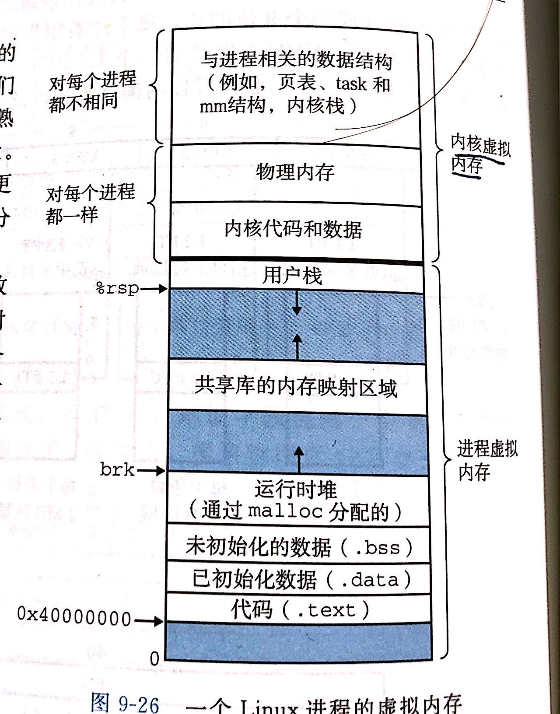
    * 首先介绍一下进程的内存布局(从低到高)
      * 代码段：存放机器指令
      * 数据段：初始化的全局数据和静态数据(生命遍布整个程序运行周期)
      * BSS段：未初始化的全局和静态数据
      * 堆：有一个指向堆顶的brk指针，对和映射段都是用于动态申请的内存
      * 映射段：用于大于128k的内存申请，高效IO
      * 栈：存放临时遍历，以及函数调用的上下文保存(利用后入先出的特点)
      * 内核空间：用户进程不能直接访问
    * malloc申请的动态内存是在堆和映射区申请的。当申请小于128k的内存，在heap中进行申请(如果heap大小不够，调用brk或者sbrk扩展heap)，当申请大内存是，利用mmap在映射区进行匿名映射，申请内存。

        malloc采用的是基于分离适配的分离空闲链表，这样可以避免显示空闲链表需要线性时间进行查找的问题。
        
        ps:分离适配是找到最合适的块后，对其进行分割，并且插入到适合的表中的方法。具体可见csapp(e3)第9章。

* 类的内存分布  
    * static
        static关键字在类内，可以用来修饰成员变量和成员函数
        * 静态成员变量：存放在对象外，即使没有对象也可以被访问
        * 静态成员函数：和非静态成员函数一样，在代码段，但是，因为static不和任何对象由联系，没有this指针，所以只能访问静态数据成员
    * virtual
        * virtual函数：每个class为每个虚函数的指针构成了一个虚函数表，虚函数表在代码段，对象内部通过虚表指针(vptr)指向虚表，此外，virtual table还含有typeinfo，通常在第一项。vptr是在构造和析构函数中被设定和抹消的
        * virtual继承：对于虚继承，因为要实现共享实例，cfront是在派生类中安排指向虚基类的指针，达到共享的目的。MS将虚基类通过虚基类表实现，派生类多一个指针即可。还有一种是在虚函数表中，放置虚基类的offeset，达到共用实体的效果。

* 大小端判断
    ```c
    //true 小端， false 大端
    union test {
        int i;
        char c;
    }
    test t;
    t.i =  1;
    return t.c == 1;
    ```


* 布隆过滤器
    利用k个哈希函数，映射为mbit数组，通过判断是否被置位来判断元素是否在集合中，复杂度为O(k)

    但是结果只有不在是确定的，在只能是概率上在

## 算法和数据结构

### 1.一致性哈希
* 普通集群  
    将固定的key映射到固定的节点，节点只存放各自key的数据。  

    这种方法需要维护一个key和节点关系的表格，当其中一台宕机，节点的数据要进行迁移，表格要重新维护。并且，当查找某个key对应数据，需要遍历所有表格，直到找到存放的节点，然后再去节点读

* hash集群  
    很容易想到的一个解决查找表的方法是对key做hash，将keyhash到集群中的各个节点中。

    hash集群可以快速找到key对应的节点，然后从中取出数据，但是当集群增减节点的时候，需要将整个集群的数据重新映射一遍才行，工作量太大

* 一致性hash  
    一致性hash为了在增加或减少一个节点的时候，尽可能的小的改变已存在key的映射关系  
    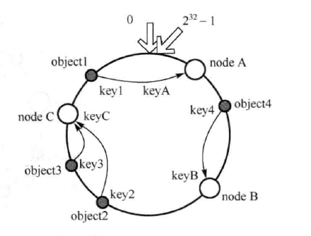
    示意图如图，算法将hash的值空间当做一个环形，然后对数据(object)做hash，得出哈希值在圆环中的分布，然后再将集群中的节点也映射到圆环中(可以利用IP或主机名等作为关键字key)，在选取数据映射的节点时，数据选取顺时针方向遇到的第一个key节点机器作为存储。

    在增加节点时，显然只会影响环形空间中，新加节点逆时针访问，直到下一个机器节点中间的数据。

    在移除节点，受影响的只有删除节点逆时针访问的数据(直到下一个节点)

    可以看到，增加和移除节点受影响的范围被大大减少到只有圆环中的一小部分

    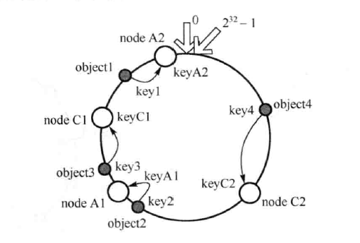
    当机器节点比较少，分布不均匀的时候，有可能节点到机器映射的很不平衡，可以为每个机器产生虚拟节点来解决这个问题。

### 2.胜者树，败者树

采用2路归并排序，每个数据需要进行log2N次IO，访问外存的次数较多，效率很低。

如果采用K路选择，则每个只要进行logKN次，IO，可以有效的减少IO次数，但是增加K值，会降低内部排序的效率，因此引入了胜者树、败者树算法

* 胜者树  
    胜者树的定义：
    * 胜者树是一颗完全二叉树
    * 胜者树的叶子结点保存我们的一个输入缓冲区（一路归并顺序表）；  叶节点L[ 1……n]
    * 胜者树的非叶子节点保存当前比较的胜者的输入缓冲区的指针；非叶子节点B[1……n-1] //存储的是数组L的索引
    * 胜者树的根节点保存我们的胜者树当前的的一次比较中的冠军（最优值） B[0]  
    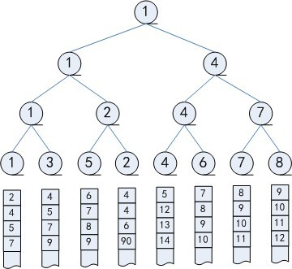  
    然后，不断取出根节点，写入缓冲区，并且更新对应的叶子节点，然后不断向上跟新比较结果(跟兄弟比较)。

* 败者树  
    败者树的定义：
    * 败者树是一颗完全二叉树（败者树是树形选择排序的一种变形）
    * 败者树的叶子结点保存的是我们的输入缓冲区
    * 败者树的非叶子结点保存我们的当前的比较中败者的对应的输入缓冲区的指针
    * 败者树根保存我们的当前比较的亚军，根上面还有一个节点保存我们的冠军  
    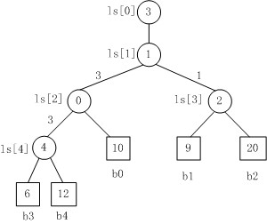  
    败者树将败者储存，然后让胜者继续进行下一轮的比赛。
    将新进入选择树的结点与其父结点进行比赛：将败者存放在父结点中；而胜者再与上一级的父结点比较。 
    比赛沿着到根结点的路径不断进行，直到ls[1]处。把败者存放在结点ls[1]中，胜者存放在ls[0]中。

胜者树、败者树和堆的相同点：空间和时间复杂度均相同——调整一次的时间复杂度都是 O(logN)，空间复杂度为O(1)。

但是，堆在取出堆顶后，进行跳转，会把最后一个数换到堆顶，然后下滤，下滤过程中，需要左右节点的值来决定下滤的方向。

胜者树相对于此，可以减少一次比较，因为只会在叶子节点更新的分支进行更新。

败者树相对于胜者树，如果更新的节点此前为胜者，那么和父亲节点比较即可，此时可以减少一次外存访问，但是如果是此前就是败者，那么就不得不更新了(但是，如果每次取的是根节点，似乎这种情况是不存在的)

### 3.海量数据处理
* 分治-hash映射(给定a、b两个文件，存放50亿url，并且占64字节，内存限制4GB，找出相同的url)  
    将文件一点一点读入，然后对hash(url)%K，就可以将文件分为K个小文件，这样，相同的url一定被分在了同一个小文件中，可以再对小文件进行读入处理。

* topK问题(海量数据下找出最大的前K个数之类)  
    * 如果能读入内存，快排找pivot方案可以在O(n)时间内找到
    * 维护小根堆，可以在O(nlogK)时间内找到
    * 利用hash(x) %K进行分块，在每个小文件统计单词出现的频率，再对文件进行归并排序。

* Bit-map
    bit-map可以用位数组来表示某些元素是否存在，可以大大节省存储空间。  
    当需要判断集合是否重复时，如果数据量比较大，用此方法很合适。能够很好的节省空间。  
    统计出现多次的话，可以用2个bit来表示

* 布隆过滤器  
    bit-map是申请N(集合中最大整数)位的数组 ，每一位对应一个特定整数

    布隆过滤将一个m位的数组，k个hash函数，每个hash函数可以将集合中的元素映射到为数组的某一位。

    当插入一个元素时，用k个hash函数计算置位的k位。查询时，**如果k位都是1，则可能在，否则，一定不在。**

### 4.B树，B+树
B树也称B-树,它是一颗多路平衡查找树。我们描述一颗B树时需要指定它的阶数，阶数表示了一个结点最多有多少个孩子结点，一般用字母m表示阶数。当m取2时，就是我们常见的二叉搜索树。可以用节点的路数范围表示B数(ceil(m/2), m-)树  

一颗m阶的B树定义如下：
* 最多m-1个关键字
* 根节点最少可以只有1个关键字
* 非根节点至少有ceil(m/2)向上取整 - 1个关键字
* 节点中关键字升序排列，且关键字的左子树小于他，右子树大于他
* 所有叶子节点在同一层

因为B树是多路版本的平衡BST，所以即使有大量的数据，高度也可以很低。

* 插入和分裂  
    当插入元素后，节点数超过m-1，则进行分裂，去中位数s=floor(m/2)，进行划分，将key_s上升一层，逐层上传，如果根节点还上溢，则整棵树高度上升一层。  
* 删除和下溢  
    将要删除节点和后继互换，然后在后继(右的最左，一定是叶子节点)的分支中删除  
    当左右兄弟存在，且-1不下溢的话，可以通过旋转，来进行补齐  
    当兄弟不满足删除条件，可以进行合并，这会导致父亲节点减少一个节点，因此也需要逐层上传。

B+树和B树的区别在于
* n个子树的节点中有n个关键字
* 非叶子节点是索引部分，数据域只保存在叶子节点中

由于这些特点，B+树与B树相比
* key的大小变小了，可以支持更多的key，IO效率高
* B+遍历全部信息只需要遍历叶子节点即可
* 查询效率稳定，每次查询效率相当


### 5.AVL和红黑树

AVL是左右子树平衡因子(高度差绝对值)小于等于1的树。

插入删除都可能造成失衡，可以通过3+4重构进行平衡。但是，删除操作会逐步上滤，至多需要logn次调整。

红黑树希望减小AVL删除操作的logn次结构调整，红黑树定义：  
* 树根为黑色
* 外部节点均为黑色
* 其余节点，若为红，则只能有黑孩子(红的父，子均为黑)
* 外部节点到根的路径途中黑色节点数目想到

如果将红黑树的红节点上移一层，其实就是(2, 4)树

* 红黑树的插入和双红缺陷  
    红黑树插入的新节点以红色染色进行插入，这样只有父子节点为黑这一条不满足。  

    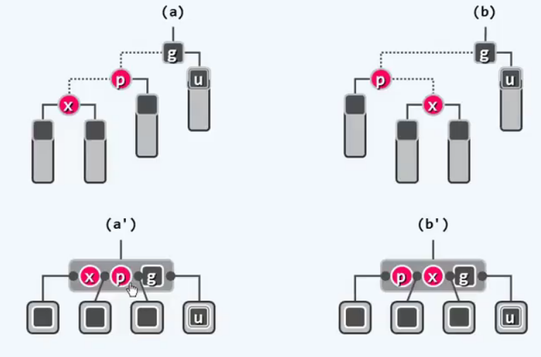  
    如果双红上溢对应的等效B树节点没有溢出，那么只需要做3+4重构，改变染色，即可全局恢复  
    
    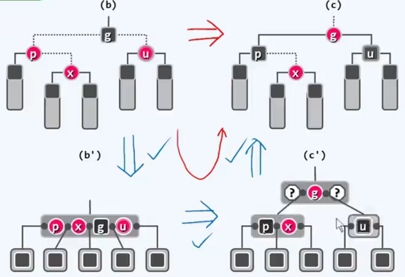  
    如果会发生溢出，那么就要进行分裂，将中间节点染红后，移入上一层，这种情况有可能上溢到根节点，但是，过程中只有染色，没有结构调整，而一旦进行结构调整，红黑树必将重新平衡

* 红黑树的删除和双黑缺陷
    删除情况太多，国语复杂，先不考虑了。。。
    但是要知道删除的结构调整次数也是只有常数次


## 设计模式

### 1.单例模式

### 2.工厂模式

### 3.观察者模式

### 4.装饰器模式

### 5.OOP设计模式

